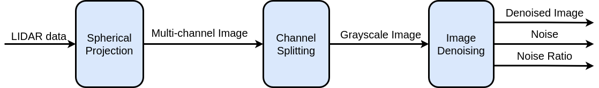

# PointCloud Denoising

Denoise LIDAR PointCloud using Spherical Proection and Image Processing.

_**Updated: 15/06/2021 by Vu-Hoi HUYNH**_

<!-- ##### [To do]

-  -->

## 1. Case study
- Test white noise from LIDAR data, which contains following multidimensional varibales:
  - Azimuth angle
  - Elevation angle
  - Distance
  - Intensity
- The idea is to project LIDAR PointCloud from spherical space into a 2D image, then to denoise each channel of the image by Computer Vision methods: 
<p align="center">
  
</p>

## 2. LIDAR PointCloud Data Structure
- Azimuth vector: $\bm{A} = [a_0 \; a_1 \; \dots \; a_n]^T = [a_j]^T_{0 \leq j \leq n}$
- Distance vector: $\bm{D} = [d_j]^T_{0 \leq j \leq n}$
  - Where $d_j = [32 a_j + k]^T_{e_{max} \geq k \geq e_{min}}$ and $k$ lies from maximum elevation angle to minimum one.
- Intensity vector: $\bm{I} = [i_j]^T_{0 \leq j \leq n}$
  - Where $i_j = [32 a_j + k]^T_{e_{max} \geq k \geq e_{min}}$ and $k$ lies from maximum elevation angle to minimum one.

## 3. Theorical summary

#### 3.1 Spherical projection
- The principle of `Spherical projection`:
<p align="center">
  
</p>

- Where:
  - `Unwrapped sphere` is a degree-based image with two dimensions of elevation and azimuth angles:
    <p align="center">
      
    </p>
  - `Spherical image` is a pixel-based image with two normalized dimensions of elevation and azimuth angles:
    <p align="center">
      
    </p>
  - `Multi-channel image` contains 4 channels : Elevation, Azimuth, Distance, Intensity

- In our case, PointCloud is already in spherical space so we ignore the first step of `Cartesian Spherical Convertor`.

#### 3.2 Channel Splitting
- The `Channel Splitting` is to split multi-channel image into grayscale ones.
- In our case, the `Distance` and `Intensity` are studied.

#### 3.3 Image Denoising
- The principle of `Image Denoising`:
<p align="center">
  
</p>

- Where:
  - `Denoising` uses [fastNlMeansDenoising](https://docs.opencv.org/3.4/d1/d79/group__photo__denoise.html#ga4c6b0031f56ea3f98f768881279ffe93).
  - `Noise Filtering` uses [Thresh to zero](https://docs.opencv.org/master/d7/d1b/group__imgproc__misc.html#gaa9e58d2860d4afa658ef70a9b1115576) to consider pixels which are smaller than a level, as non-noise pixels and then counters the quantity ratio of `Number of nonzero pixels / Number of all pixels` as a varibale which shows the noisy level of the `Grayscale image`.

## 4. Usage
- Prerequisites: OpenCV and TinyXML2
- The paramters should be modified inside `parameters/parameterFile.xml`
- Installation and testing:

```shell
$ mkdir build
$ cd build
$ cmake .. -DCMAKE_INSTALL_PREFIX=../install
$ make
$ ./PointCloud_Denoising ../parameters/parameterFile.xml
```

## 5. References
- [`Spherical Projection for Point Clouds`](https://towardsdatascience.com/spherical-projection-for-point-clouds-56a2fc258e6c)
- [`Computer Vision: Panorama, p.86`](https://www.cs.toronto.edu/~urtasun/courses/CV/lecture08.pdf)
- [`Image Denoising`](https://docs.opencv.org/master/d5/d69/tutorial_py_non_local_means.html)


